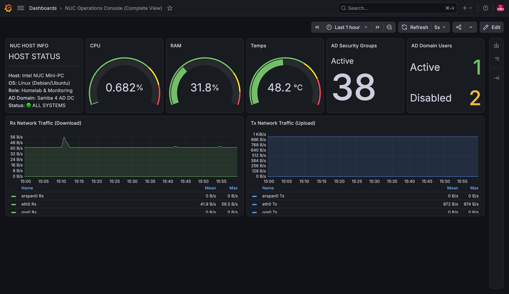
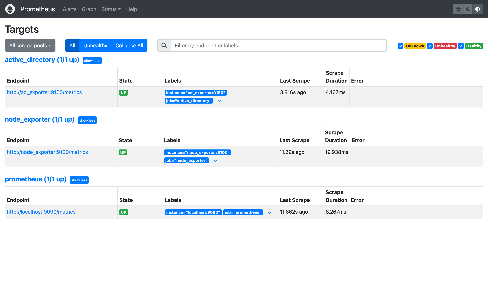
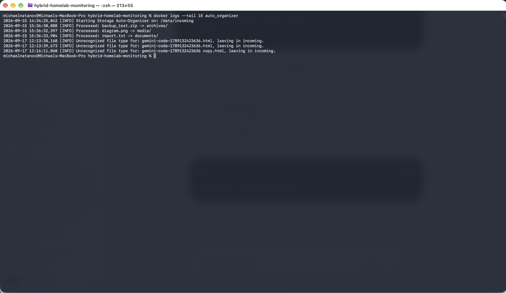
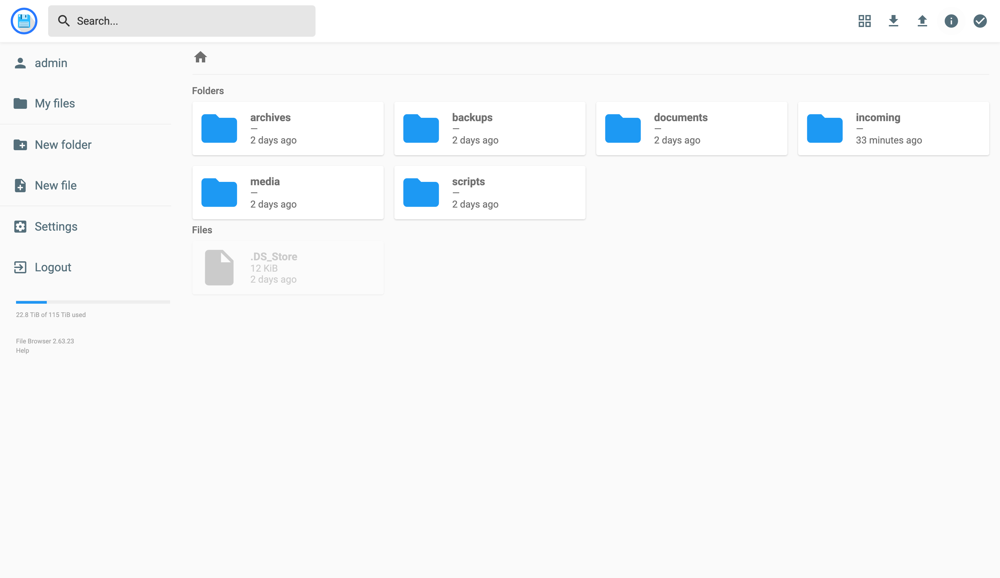

# Enterprise Hybrid Homelab & Active Directory Observability Stack

An automated, containerized infrastructure monitoring and directory services stack designed for enterprise homelab environments. The project integrates a fully functional Samba 4 Active Directory Domain Controller, host and directory telemetry via Prometheus, a custom Python LDAP exporter, provisioned single-pane-of-glass Grafana dashboards, automated storage pipelines, and Telegram incident alerting.

Engineered and validated on macOS with automated one-command portability to headless Linux hosts (such as an Intel NUC running Ubuntu Server).

---

## Operations Dashboard (NOC Console View)



---

## Architecture & Service Map

The entire stack runs inside Docker using an isolated bridge network (`monitoring_net`):

[ Host Hardware / OS Layer ]
│
├─► Node Exporter ─────────────┐ (HTTP GET /metrics)
│                              ▼
├─► Samba 4 AD DC ──► AD Exporter ──► Prometheus TSDB ──► Grafana Dashboard
│                                            │
└─► File Browser ──► Auto-Organizer          ▼
Alertmanager ──► AI Responder Webhook


* **Samba 4 AD DC (`samba_ad`):** Full Active Directory Domain Controller (functional level 2012 R2). Serves LDAP (389), LDAPS (636), Kerberos (88), and internal AD DNS (53).
* **AD Prometheus Exporter (`ad_exporter`):** Custom Python service (`ldap3` + `prometheus_client`). Scrapes the AD directory every 15 seconds, decodes `userAccountControl` bitmasks to differentiate between active and disabled accounts, counts security groups, and exposes Prometheus metrics on port 9150.
* **Prometheus (`prometheus`):** Core time-series database scraping system metrics from `node_exporter` and domain stats from `ad_exporter`. Evaluates threshold alerting rules.
* **Alertmanager (`alertmanager`):** Handles alert deduplication, grouping, and dispatching to notification webhooks.
* **AI Incident Responder (`ai_responder`):** Python-based alert ingestion service receiving webhooks from Alertmanager and forwarding incident telemetry to Telegram.
* **Grafana (`grafana`):** Unified visualization layer. Dashboards and Prometheus data sources are configured completely as code via declarative provisioning.
* **Storage & Auto-Organizer (`filebrowser`, `auto_organizer`):** Web file management UI backed by an event-driven background daemon (`watchdog`) that scans ingest directories and sorts files by MIME type (documents, media, archives, code).

---

## Telemetry & Verification Proofs

| Prometheus Scrape Targets (All UP) | Real-time Auto-Organizer Processing Logs |
|:---:|:---:|
|  |  |

### Web Storage Management Console


---

## Engineering Challenges & Workarounds

### 1. Extended Filesystem Attributes (xattr & ACL) on Containerized AD
* **Problem:** Samba 4 AD DC provisioning fails during the `sysvol` setup phase (`setsysvolacl` returning `NT_STATUS_ACCESS_DENIED`) on environments where the underlying storage driver does not provide full POSIX extended attributes (`user_xattr`) and Windows NT ACL support (such as default macOS Docker Desktop virtual disk mounts).
* **Resolution:** The `entrypoint.sh` startup script creates an internal 1GB block-level `ext4` filesystem image via `mkfs.ext4`, mounts it dynamically to `/var/lib/samba` using loopback flags `loop,user_xattr,acl`, and executes provisioning over native POSIX storage. This guarantees identical behavior across macOS Docker VM and bare-metal Linux.

### 2. Simple Bind Authentication over LDAP
* **Problem:** Samba AD defaults to rejecting non-SASL simple binds over unencrypted LDAP with a `strongerAuthRequired` error.
* **Resolution:** Configured the domain controller parameter `ldap server require strong auth = no` within the internal Docker network. This allows the lightweight containerized Python exporter to perform high-frequency metric queries without manual certificate provisioning overhead.

### 3. Declarative Dashboard Provisioning (IaC)
* **Problem:** Manual changes in Grafana are stored in an internal SQLite database inside Docker volumes, which can be lost during volume resets (`docker compose down -v`).
* **Resolution:** Fully exported the dashboard JSON into `grafana/provisioning/dashboards/` alongside provider YAML definitions, ensuring the monitoring dashboard rebuilds automatically from source code.

---

## Service Matrix & Network Ports

| Service | Host Port | Protocol | Purpose |
| :--- | :--- | :--- | :--- |
| **Grafana** | `3000` | HTTP | Real-time monitoring dashboards (`admin` / `admin`) |
| **Prometheus** | `9090` | HTTP | Time-series query engine and target inspection (`/targets`) |
| **Alertmanager** | `9093` | HTTP | Alert pipeline and routing UI |
| **Filebrowser** | `8080` | HTTP | Web interface for network storage |
| **AD Exporter** | `9150` | HTTP | Active Directory Prometheus scrape endpoint (`/metrics`) |
| **Node Exporter** | `9100` | HTTP | Host compute and operating system metrics |
| **Samba AD DC** | `389, 88, 53` | TCP/UDP | LDAP, Kerberos authentication, Domain DNS (`HOMELAB.LAN`) |

---

## Deployment & Verification

### 1. Initial Setup
```bash
git clone [https://github.com/mihgun1r1/hybrid-homelab-monitoring.git](https://github.com/mihgun1r1/hybrid-homelab-monitoring.git)
cd hybrid-homelab-monitoring
cp .env.example .env
### 2. Execute Deployment Script
```bash
chmod +x deploy.sh
./deploy.sh
### 3. Verify Health Endpoints
Prometheus Targets: Open http://localhost:9090/targets and ensure active_directory, node_exporter, and prometheus show UP.

AD Exporter Output: Verify raw metrics at http://localhost:9150/metrics.

Grafana Dashboard: Access http://localhost:3000 to review CPU, memory, storage utilization, and Active Directory user status.

Active Directory Management CLI
Manage directory objects directly using samba-tool inside the domain controller container:

```bash
# Create Domain User
docker compose exec samba_ad samba-tool user create devops_user "Passw0rd2026!" --description="DevOps Team Member"

# Disable Account
docker compose exec samba_ad samba-tool user disable devops_user

# Enable Account
docker compose exec samba_ad samba-tool user enable devops_user

# List All Domain Users
docker compose exec samba_ad samba-tool user list

# List Security Groups
docker compose exec samba_ad samba-tool group list